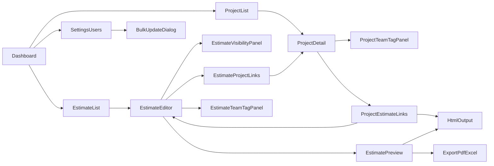

# 見積機能 Phase1 UIワイヤー

## 対象画面
- 追加: 見積一覧
- 追加: 見積作成/編集（入力画面）
- 追加: 見積プレビュー/HTML出力
- 追加: 見積公開範囲設定（全体公開/個別制限）
- 変更: Dashboardナビ（Project横に見積）
- 変更: Project詳細（チームタグ付け）
- 変更: Project詳細（見積との双方向リンク・遷移）
- 変更: 見積詳細（Projectとの双方向リンク・遷移）
- 変更: Project詳細/見積アクセス設定を完全同一UI化（共通コンポーネント）
- 追加: 設定 > User一覧（一括タグ付与/一括管理者付与）
- 追加: 一括更新前の確認ダイアログ

## 1. 画面遷移ワイヤー


## 2. Dashboard（変更）
```text
+----------------------------------------------------------------------------------+
| Header: Logo | Search | UserMenu                                                 |
+----------------------------------------------------------------------------------+
| Sidebar                                                                       |
| - Dashboard                                                                    |
| - ...既存App                                                                   |
| - Project                                                                      |
| - 見積  <- 新規導線                                                             |
| - Settings                                                                     |
+-----------------------------------+----------------------------------------------+
| Main                              | 既存ダッシュボードカード                     |
|                                   | [Project] [見積] <- カード追加               |
+-----------------------------------+----------------------------------------------+
```

## 3. 見積一覧（新規）
```text
+------------------------------------------------------------------------------------------------------+
| 見積一覧                                                                                              |
| [新規作成] [CSV/Excel出力]                                                                            |
+------------------------------------------------------------------------------------------------------+
| Filter: [Project] [チームタグ] [担当営業] [ステータス] [更新日From-To] [検索]                        |
+------------------------------------------------------------------------------------------------------+
| Table                                                                                                 |
| □ | 見積番号 | 件名 | 顧客名 | Project | 合計(税込) | ルールVer | 更新者 | 更新日 | 操作(編集/複製/出力) |
|------------------------------------------------------------------------------------------------------|
| □ | 2026xxxx | ...  | ...    | ...     | ...        | v2026...  | ...    | ...    | ...                 |
+------------------------------------------------------------------------------------------------------+
| Pagination                                                                                             |
+------------------------------------------------------------------------------------------------------+
```

## 4. 見積作成/編集（新規・最重要）
### 4-1. レイアウト
```text
+------------------------------------------------------------------------------------------------------+
| 見積作成/編集                                                                                          |
| [下書き保存] [プレビュー] [HTML出力確認] [PDF出力] [Excel出力]                                        |
+------------------------------------------------------------------------------------------------------+
| 左: 基本情報(ヘッダ)                                   | 右: 権限/連携                                 |
| - 見積先                                               | - Project紐づけ                               |
| - 見積番号(自動/手動)                                  | - チームタグ権限(owner/editor/viewer)         |
| - 発行日                                               | - ルールバージョン                            |
| - 納入予定                                             | - 担当営業                                    |
| - 件名/内容                                            |                                               |
| - タイトル種別（概算ON/OFF）                           |                                               |
+--------------------------------------------------------+-----------------------------------------------+
| 公開範囲設定                                                                                            |
| (●) 全ユーザー参照可能 [デフォルト]                                                                    |
| ( ) 個別設定で参照を制限（ユーザー/チーム紐づけ）                                                      |
| [個別設定を開く]  <- 個別設定選択時のみ有効                                                           |
+------------------------------------------------------------------------------------------------------+
| 明細入力                                                                                               |
| [大項目追加] [行追加]                                                                                  |
| 大項目: 要件定義/設計, SITEMANAGEライセンス, 公開側制作, 開発, その他                                 |
|------------------------------------------------------------------------------------------------------|
| 並び | 区分 | 項目名 | 数量 | 単位(人日/式/ページ/回/%) | 単価 | 係数 | 金額(自動) | 削除           |
|------------------------------------------------------------------------------------------------------|
| 1    | 要件 | ...    | 5.0  | 人日                        | 60000| 1.0  | 300000     | [x]            |
| ...                                                                                                   |
+------------------------------------------------------------------------------------------------------+
| サマリ: 小計(税抜) | 消費税率 | 消費税額 | 合計(税込)                                                   |
+------------------------------------------------------------------------------------------------------+
| 備考/前提/有効期限                                                                                     |
| [複数行テキスト]                                                                                       |
+------------------------------------------------------------------------------------------------------+
```

### 4-2. 編集可否（UI制御）
- owner: すべて編集可能（権限変更/削除含む）
- editor: 見積内容編集可能、権限変更不可
- viewer: 閲覧中心、出力のみ許可（Phase1）
- 公開範囲:
  - 新規見積は必ず「全ユーザー参照可能」を初期値にする
  - 「個別設定」を選んだ場合のみ、ユーザー/チーム紐づけパネルを編集可能にする

### 4-3. 3カラム操作レイアウト（Project詳細準拠）
```text
+------------------------------------------------------------------------------------------------------+
| 左カラム: ナビ/一覧                      | 中央カラム: 詳細編集                | 右カラム: 補助パネル               |
| - 見積一覧（検索/選択）                  | - 見積ヘッダ編集                     | - アクセス設定                     |
| - 紐づきProject一覧                      | - 明細テーブル編集                   | - Project紐づけ                    |
| - 紐づき見積一覧（Project詳細側）        | - 備考/税計算/タイトル種別            | - 出力アクション(PDF/HTML/Excel)  |
| - パンくず/戻る導線                      | - 保存/プレビュー                     | - 変更履歴/権限ヒント             |
+------------------------------------------------------------------------------------------------------+
| ※ 左で対象切替 -> 中央で編集 -> 右で関連設定、の導線で画面遷移回数を減らす                             |
+------------------------------------------------------------------------------------------------------+
```

## 5. 見積プレビュー/HTML出力（新規）
```text
+------------------------------------------------------------------------------------------------------+
| 見積プレビュー                                                                                          |
| [HTML表示] [PDF出力] [Excel出力] [編集へ戻る]                                                           |
+------------------------------------------------------------------------------------------------------+
| A4プレビュー                                                                                           |
|------------------------------------------------------------------------------------------------------|
| 会社ロゴ                 [概算ON] 概算御見積書 / [概算OFF] 御見積書                                   |
| 見積先: xxxx             見積番号: xxxxx                                                               |
| 作成年月日: yyyy/mm/dd   営業担当: xxxx                                                                |
| 件名: xxxxx                                                                                             |
|------------------------------------------------------------------------------------------------------|
| 明細テーブル                                                                                             |
| 数量 | 単位 | 単価 | 金額                                                                              |
| ...                                                                                                   |
|------------------------------------------------------------------------------------------------------|
| 税抜金額: xxx  消費税: xxx  税込合計: xxx                                                              |
| 備考:                                                                                                  |
| - 仕様変更時は別途見積                                                                                  |
| - 有効期限                                                                                              |
+------------------------------------------------------------------------------------------------------+
```

## 6. Project詳細（変更: アクセス設定共通UI）
```text
+--------------------------------------------------------------------------------------+
| Project詳細                                                                           |
| ...既存情報...                                                                        |
|--------------------------------------------------------------------------------------|
| アクセス設定（共通コンポーネント: AccessControlTable）                               |
| [対象追加] [保存]                                                                     |
|                                                                                      |
| 種別    対象             権限             継承元         操作                         |
| team   #sales          [owner v]       Project        [削除]                        |
| team   #dev            [editor v]      Project        [削除]                        |
| team   #support        [viewer v]      Project        [削除]                        |
|                                                                                      |
+--------------------------------------------------------------------------------------+
| 紐づき見積                                                                            |
| [見積を紐づける]                                                                       |
|--------------------------------------------------------------------------------------|
| 見積番号      件名                      権限状態        操作                           |
| 2026-0001    コーポレート改修見積       viewer/edit可   [編集へ] [HTML出力へ]         |
| 2026-0002    保守見積                   viewer          [詳細へ] [HTML出力へ]         |
+--------------------------------------------------------------------------------------+
```

## 7. 見積アクセス設定（新規・Project詳細と完全同一UI）
```text
+--------------------------------------------------------------------------------------+
| 見積アクセス設定                                                                       |
| 公開範囲: [全ユーザー参照可能 v] / [個別設定(ユーザー・チーム) v]                      |
| [Project権限を再同期] [対象追加] [保存]                                                |
|--------------------------------------------------------------------------------------|
| アクセス設定（共通コンポーネント: AccessControlTable）                                 |
| 個別設定時のみ編集有効                                                                  |
| 種別    対象             権限             継承元         操作                           |
| team   #sales          [owner v]       Project        [削除]                          |
| team   #dev            [editor v]      Project        [削除]                          |
| user   yamada@example  [viewer v]      Estimate       [削除]                          |
|--------------------------------------------------------------------------------------|
| ※「全ユーザー参照可能」の場合、この一覧は参照のみ（編集不可）                          |
| [適用して閉じる]                                                                       |
+--------------------------------------------------------------------------------------+
```

## 8. 見積詳細内 Project紐づけ（新規）
```text
+--------------------------------------------------------------------------------------+
| 見積詳細                                                                               |
| ...見積ヘッダ/明細...                                                                  |
|--------------------------------------------------------------------------------------|
| 紐づきProject                                                                           |
| [Projectを紐づける]                                                                     |
|--------------------------------------------------------------------------------------|
| ProjectID     Project名                  権限状態        操作                          |
| P-000123      コーポレートサイト刷新      viewer/edit可   [Project詳細へ] [紐づけ解除] |
| P-000456      保守対応                    viewer          [Project詳細へ]              |
+--------------------------------------------------------------------------------------+
| ※編集権限がない場合、紐づけ追加/解除ボタンは非表示またはdisabled                      |
+--------------------------------------------------------------------------------------+
```

## 9. 設定 > User一覧（変更: 一括タグ/管理者付与）
```text
+------------------------------------------------------------------------------------------------------+
| 設定 > User一覧                                                                                       |
| [選択中 n 件] [タグ一括追加] [タグ一括置換] [管理者付与] [管理者解除]                                 |
+------------------------------------------------------------------------------------------------------+
| Filter: [名前] [メール] [teamタグ] [管理者ON/OFF] [検索]                                               |
+------------------------------------------------------------------------------------------------------+
| □ | ユーザー名 | メール | teamタグ(複数) | 管理者 | 最終更新 | 操作                                   |
|------------------------------------------------------------------------------------------------------|
| □ | 山田       | ...    | #sales #tokyo  | ON    | ...      | 詳細                                   |
| □ | 佐藤       | ...    | #dev           | OFF   | ...      | 詳細                                   |
+------------------------------------------------------------------------------------------------------+
```

## 10. 一括更新確認ダイアログ（新規）
```text
+--------------------------------------------------------------------------------------+
| 一括更新の確認                                                                        |
|--------------------------------------------------------------------------------------|
| 対象ユーザー: 24名                                                                    |
| 変更内容:                                                                             |
| - 追加タグ: #sales                                                                    |
| - 解除タグ: #partner-a                                                                |
| - 管理者付与: 2名                                                                     |
| - 管理者解除: 1名                                                                     |
|                                                                                      |
| 注意: 自分自身の管理者解除は実行できません。                                          |
|                                                                                      |
| [キャンセル]                                              [確認して実行]              |
+--------------------------------------------------------------------------------------+
```

## 11. 権限考慮の遷移ルール（Project↔見積）
- Project詳細 -> 見積編集: 対象見積で `editor` 以上
- Project詳細 -> 見積HTML出力: 対象見積で `viewer` 以上
- 見積詳細 -> Project詳細: 対象Projectで `viewer` 以上
- 見積詳細でのProject紐づけ追加/解除: 対象見積で `editor` 以上
- 遷移不可時はボタンを非表示またはdisabled+ツールチップ表示

## 12. UIコンポーネント指針
- テーブル操作は既存UI（一覧・チェックボックス・ページネーション）に合わせる
- タグ入力は候補サジェスト + Enter確定
- 権限セレクトは `owner/editor/viewer` の3値固定
- 合計金額は常に画面下部に固定表示し、編集時の視認性を維持
- HTML帳票はA4印刷前提でフォント/余白を固定
- Project↔見積リンク一覧には「編集へ」「HTML出力へ」「Project詳細へ」を権限に応じて表示切替
- 見積書タイトルは「概算ON/OFF」で `概算御見積書` / `御見積書` を切替可能にする
- Project詳細と見積アクセス設定は `AccessControlTable` を共通利用し、同一テーブル・同一操作ボタンを維持する
- 主要編集画面はProject詳細準拠の3カラム構成（左:一覧/遷移、中:編集、右:関連設定）で統一する

## 13. 実装優先順位（UI）
1. 見積作成/編集（入力画面）
2. 見積プレビュー/HTML出力
3. Project詳細↔見積の相互リンク/相互遷移UI
4. 見積一覧
5. Project詳細のチームタグ設定
6. 設定>User一覧 + 一括更新確認ダイアログ
