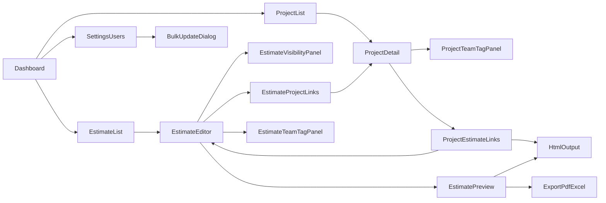

# 見積機能 Phase1 UIワイヤー

## 実装状況（2026-04-26）
- 実装済み
  - Dashboard の `Estimates` 導線（サイドバー/カード）
  - 見積一覧、見積作成/編集（3カラム）、公開範囲設定、権限設定テーブル
  - 明細D&D、ドラッグハンドル表示、行複製、全行 人月↔人日 変換
  - Undo/Redo（やり直し/すすむ）アイコン
  - テンプレ読込/保存（個人/全体）
  - Project詳細の紐づき見積表示 + 見積選択モーダルによる紐づけ更新
  - 設定 > User一覧（複数選択、一括タグ/管理者更新、確認ダイアログ）
  - プレビュー/Excel出力の接続、A4超過警告表示
  - 見積プレビュー専用画面（`HTML表示 / 印刷 / Excel出力 / 編集へ戻る`）
  - 見積一覧フィルタ（ステータス/Project/チームタグ/担当営業/更新日From-To/キーワード）とフィルタクリア
  - Project↔見積の遷移ボタン活性制御（viewer/editorを考慮した活性/無効化）
  - 見積一覧ページネーション（表示件数切替、前へ/次へ）
  - 変更履歴（監査ログ）表示パネル（見積編集 右カラム）
  - 監査ログの対象拡張（取込/権限変更/一括更新まで記録）
  - 一覧テーブルの server-side ページネーション（フィルタ連動）
  - 印刷運用を要件定義書と同等化（プレビュー画面の印刷ボタン）
- 未実装 / 追加対応中
  - 見積編集画面: **下部固定の税抜・消費税・税込合計サマリー**（スクロール追随・閉じる・再表示・**Cookie で表示状態を見積跨ぎで保持**。折りたたみは不要）— ワイヤー・ライフサイクルは Cursor プラン `estimate_line_calc_buttons_1be3f519.plan.md`（`.cursor/plans/`）の **「見積編集・下部固定 合計サマリー」** 節を参照（旧 §16 はそちらへ移植済み）

> 注: PDF本出力パイプラインは「不要。プレビュー画面の印刷ボタン運用」とする方針へ変更済み。

## 実装チェック（漏れ確認）
- 実装済み: Dashboard導線（`Estimates`）
- 実装済み: 見積一覧（フィルタ + server-side ページネーション + 権限別操作）
- 実装済み: 見積作成/編集（3カラム、明細D&D、Undo/Redo、全行 人月↔人日）
- 実装済み: 公開範囲/アクセス設定（`AccessControlTable` 共通UI）
- 実装済み: Project詳細↔見積 双方向リンク/遷移（権限考慮）
- 実装済み: テンプレ保存/読込（個人/全体）、見積複製、行複製
- 実装済み: プレビュー（HTML表示/印刷/Excel出力）+ A4超過警告
- 実装済み: 監査ログ（作成/更新/削除/公開範囲/取込/権限変更/一括更新）
- 実装済み: 設定 > User一覧（一括タグ/管理者更新 + 確認ダイアログ + 自己解除防止）
- Phase2対象（未実装扱いにしない）: HubSpot連携、クライアント名表記ゆれ補正

## 対象画面
- 追加: 見積一覧
- 追加: 見積作成/編集（入力画面）
- 追加: 見積プレビュー/HTML出力
- 追加: 見積公開範囲設定（全体公開/個別制限）
- 変更: Dashboardナビ（Project横に見積）
- 変更: Project詳細（チームタグ付け）
- 変更: Project詳細（見積との双方向リンク・遷移）
- 変更: 見積詳細（Projectとの双方向リンク・遷移）
- 変更: Project詳細/見積アクセス設定を完全同一UI化（共通コンポーネント）
- 追加: 設定 > User一覧（一括タグ付与/一括管理者付与）
- 追加: 一括更新前の確認ダイアログ
- 変更: 見積番号の自動採番ルール定義

## 1. 画面遷移ワイヤー


## 2. Dashboard（変更）
```text
+----------------------------------------------------------------------------------+
| Header: Logo | Search | UserMenu                                                 |
+----------------------------------------------------------------------------------+
| Sidebar                                                                       |
| - Dashboard                                                                    |
| - ...既存App                                                                   |
| - Project                                                                      |
| - Estimates  <- 新規導線（英語表記）                                           |
| - Settings                                                                     |
+-----------------------------------+----------------------------------------------+
| Main                              | 既存ダッシュボードカード                     |
|                                   | [Project] [Estimates] <- カード追加           |
+-----------------------------------+----------------------------------------------+
```
- アイコン方針: サイドバー/カードともに「見積書」を連想しやすい請求書・ドキュメント系アイコンを採用する（1目で見積と判別可能なもの）

## 3. 見積一覧（新規）
```text
+------------------------------------------------------------------------------------------------------+
| 見積一覧                                                                                              |
| [新規作成] [CSV/Excel出力]                                                                            |
+------------------------------------------------------------------------------------------------------+
| Filter(IF):                                                                                          |
| - Project: [Select: プロジェクト名候補（部分一致検索付き）]                                          |
| - チームタグ: [TagSuggestInput: 複数選択可 / 標準候補+履歴候補]                                      |
| - 担当営業: [UserSelect: 担当者一覧（前方一致）]                                                     |
| - ステータス: [Select: 下書き / 提出済み / 受注 / 失注 / 全て]                                      |
| - 更新日: [DatePicker: From] ～ [DatePicker: To]                                                     |
| - キーワード: [TextInput: 見積番号・件名・顧客名を横断検索]                                          |
| - 操作: [フィルタクリア] [検索]                                                                       |
+------------------------------------------------------------------------------------------------------+
| Table                                                                                                 |
| □ | 見積番号 | 件名 | 顧客名 | Project | 合計(税込) | ルールVer | 更新者 | 更新日 | 操作(編集/複製/出力) |
|------------------------------------------------------------------------------------------------------|
| □ | 2026xxxx | ...  | ...    | ...     | ...        | v2026...  | ...    | ...    | ...                 |
+------------------------------------------------------------------------------------------------------+
| Pagination                                                                                             |
+------------------------------------------------------------------------------------------------------+
```

## 4. 見積作成/編集（新規・最重要）
### 4-1. レイアウト
```text
+------------------------------------------------------------------------------------------------------+
| 見積作成/編集                                                                                          |
| [Excelアイコン(緑) + Excel出力] [プレビュー] [やり直し] [すすむ] [SAVE]                                |
+------------------------------------------------------------------------------------------------------+
| 左: 基本情報(ヘッダ)                                   | 右: 権限/連携                                 |
| - 見積先（2行テキストエリア。初期値はクライアント名）   | - Project紐づけ                               |
| - 見積番号(自動採番)                                   | - チームタグ権限(owner/editor/viewer)         |
| - 発行日                                               | - ルールバージョン                            |
| - 納入予定                                             | - 担当営業                                    |
| - 件名/内容                                            |                                               |
| - タイトル種別（概算ON/OFF）                           |                                               |
+--------------------------------------------------------+-----------------------------------------------+
| 公開範囲設定                                                                                            |
| (●) 全ユーザー参照可能 [デフォルト]                                                                    |
| ( ) 個別設定で参照を制限（ユーザー/チーム紐づけ）                                                      |
| [個別設定を開く]  <- 個別設定選択時のみ有効                                                           |
+------------------------------------------------------------------------------------------------------+
| 明細入力                                                                                               |
| テンプレ読込 [テンプレ保存(個人)] [テンプレ保存(全体)] [大項目追加] 　　　　　　　　　　　　　　　　　　　 |
| 大項目: 要件定義/設計, SITEMANAGEライセンス, 公開側制作, 開発, その他                                 |
| SITEMANAGEライセンス選択時: [テキスト一括貼付]                                                        |
|------------------------------------------------------------------------------------------------------|
| 移動 | 区分 | 項目名 | 数量 | 単位(人月or人日/式/ページ/回/%) | 単価 | 係数 | 金額(自動) | 削除           |
|------------------------------------------------------------------------------------------------------|
| [掴] | 要件 | 要件定義 | 5.0  | 人日                       | 60000| 1.0  | 300000     | [行複製] [x]    |
|      |      | ---- ドロップ先ハイライト ----                                                            |
| ...                                                                                                   |
+------------------------------------------------------------------------------------------------------+
| 区分/項目名サジェスト                                                                                   |
| - 候補の第一優先: 社内制作単価一覧_20260107.pdf 由来の標準項目                                          |
| - 標準候補には SITEMANAGE価格表PDF（2026年度）記載の名称も含める                                         |
| - 候補の第二優先: 自分の過去入力履歴（標準候補の下にインデントして表示）                                |
| - 項目名選択時は `item_code` に紐づく標準ルールから `単位` と `単価` を自動反映する                       |
| - SITEMANAGEライセンス大項目では、価格表PDF由来のプラグイン名はサジェストから選択するほか「テキスト一括貼付」で行追加できる |
| - 一括貼付で追加した行の単価は、標準ルールに一致する場合に自動反映される（手入力も可）                    |
| - 例:                                                                                                  |
|   標準候補: 要件定義                                                                                    |
|     履歴候補:   要件定義（軽微改修）                                                                    |
|   標準候補: 開発                                                                                        |
|     履歴候補:   開発（外部連携あり）                                                                    |
+------------------------------------------------------------------------------------------------------+
| サマリ: 小計(税抜) | 消費税率 | 消費税額 | 合計(税込)                                                   |
+------------------------------------------------------------------------------------------------------+
| 備考/前提/有効期限                                                                                     |
| [複数行テキスト]                                                                                       |
+------------------------------------------------------------------------------------------------------+
| 社内メモ（社内専用・見積ごとに1か所のみ）                                                               |
| [複数行テキスト]                                                                                       |
| ※顧客向けプレビュー/HTML/PDF/印刷には表示しない                                                        |
+------------------------------------------------------------------------------------------------------+
| 税率適用オプション                                                                                     |
| - デフォルト: 見積作成日（当日）時点で有効な税率を自動選択                                              |
| - 未来開始日の税率が存在する場合: [現在税率を適用] / [未来税率を先行適用] を選択可能                    |
| - どちらを選んでも、保存時点の適用税率・適用開始日を見積データに固定保存                                |
+------------------------------------------------------------------------------------------------------+
```

### 4-5. 見積番号採番ルール
- フォーマット: `見積_yyyymmdd_顧客略称_連番[ _枝番 ]`
- `見積_`: 固定プレフィックス
- `yyyymmdd`: 見積発行日（8桁）
- `顧客略称`: クライアント共通略称（マスタ値）
- `連番`: 顧客略称内で重複しない4桁固定連番（`0001`〜`9999`、自動採番）
- 連番が `9999` に到達した次回は `0001` から再開する
- `枝番`: 見積詳細画面でユーザーが任意入力（初期値は空）
- 枝番が空の場合は枝番セグメントを出力しない（末尾アンダースコアも出さない）

### 4-2. 編集可否（UI制御）
- owner: すべて編集可能（権限変更/削除含む）
- editor: 見積内容編集可能、権限変更不可
- viewer: 閲覧中心、出力のみ許可（Phase1）
- 公開範囲:
  - 新規見積は必ず「全ユーザー参照可能」を初期値にする
  - 「個別設定」を選んだ場合のみ、ユーザー/チーム紐づけパネルを編集可能にする
- 税率:
  - 税率は見積作成時に「税率マスタ（開始日付き）」から、見積作成日に有効な値を初期値として自動適用する
  - 未来開始日の税率が登録済みの場合、ユーザーは「現在税率」または「未来税率（予約値）」を選択できる
  - 見積保存時に適用税率を見積データへ固定し、後から税率マスタが更新されても過去見積には反映しない

### 4-4. ボタン配列方針（既存画面準拠）
- 既存の Project 要件/ヒアリング画面に合わせ、右上アクションは「補助操作 -> プレビュー -> 保存（主）」の順に配置する
- 見積編集の推奨並びは `Excel出力 -> プレビュー -> やり直し -> すすむ -> SAVE`
- `Excel出力` はヒアリングシート画面と同一スタイル（緑のExcelアイコン付きボタン）を使用する
- 主操作の `SAVE` は最右・強調（accent）に固定し、誤操作を減らす
- 印刷は編集画面ではなく、見積プレビュー/HTML出力画面の主操作として配置する
- 用語定義として機能は「帳票プレビュー」とし、ボタン表示名は `プレビュー` のままにする
- `プレビュー` はHTML出力確認を兼ねる単一機能とし、編集画面に `HTML出力確認` ボタンは配置しない
- `やり直し` と `すすむ` は既存画面の履歴操作（Undo/Redo）と同じ意味で扱う
- `やり直し` / `すすむ` はテキストではなく既存画面同様のアイコンボタン（Undo/Redo）で表示し、ツールチップで文言を補足する
- テンプレート/複製ボタンはヒアリングシートの「データ行操作」ボタン群と同じ見た目（配置・配色・文言）で、明細入力エリア上部に配置する
- テンプレート機能は `テンプレ読込 / テンプレ保存(個人) / テンプレ保存(全体)` を提供し、全体保存は権限ユーザーのみ実行可能にする
- `行複製` は選択した明細行の中身のみを複製し、見積ヘッダ情報（見積先/見積番号/日付/権限等）は複製しない
- `テンプレ読込` 実行時に既存明細データがある場合は、ヒアリングシートと同一デザインの警告モーダルを表示してリセット確認を必須にする
- `SITEMANAGEライセンス` 大項目は、価格表PDF由来の名称をサジェストに含め、明細は「テキスト一括貼付」等で追加する

### 4-3. 3カラム操作レイアウト（Project詳細準拠）
```text
+------------------------------------------------------------------------------------------------------+
| 左カラム: ナビ/一覧                      | 中央カラム: 詳細編集                | 右カラム: 補助パネル               |
| - 見積一覧（検索/選択）                  | - 見積ヘッダ編集                     | - アクセス設定                     |
| - 紐づきProject一覧                      | - 明細テーブル編集                   | - Project紐づけ                    |
| - 紐づき見積一覧（Project詳細側）        | - 備考/税計算/タイトル種別            | - 出力アクション(印刷/HTML/Excel) |
| - パンくず/戻る導線                      | - 保存/プレビュー                     | - 変更履歴/権限ヒント             |
+------------------------------------------------------------------------------------------------------+
| ※ 左で対象切替 -> 中央で編集 -> 右で関連設定、の導線で画面遷移回数を減らす                             |
+------------------------------------------------------------------------------------------------------+
```

## 5. 見積プレビュー/HTML出力（新規）
```text
+------------------------------------------------------------------------------------------------------+
| 見積プレビュー                                                                                          |
| [HTML表示] [印刷] [Excel出力] [編集へ戻る]                                                             |
+------------------------------------------------------------------------------------------------------+
| A4プレビュー                                                                                           |
| ※A4縦1ページ固定。2ページ目にあふれる明細量の場合は警告表示                                             |
|------------------------------------------------------------------------------------------------------|
| 会社ロゴ                 [概算ON] 概算御見積書 / [概算OFF] 御見積書                                   |
| 見積先: xxxx（2行表示）   見積番号: xxxxx                                                             |
| 作成年月日: yyyy/mm/dd   営業担当: xxxx                                                                |
| 件名: xxxxx                                                                                             |
|------------------------------------------------------------------------------------------------------|
| 明細テーブル                                                                                             |
| 数量 | 単位 | 単価 | 金額                                                                              |
| ...                                                                                                   |
|------------------------------------------------------------------------------------------------------|
| 税抜金額: xxx  消費税: xxx  税込合計: xxx                                                              |
| 備考:                                                                                                  |
| - 仕様変更時は別途見積                                                                                  |
| - 有効期限                                                                                              |
| ※社内メモは非表示（顧客向け出力対象外）                                                                 |
+------------------------------------------------------------------------------------------------------+
```

## 6. Project詳細（変更: アクセス設定共通UI）
```text
+--------------------------------------------------------------------------------------+
| Project詳細                                                                           |
| ...既存情報...                                                                        |
|--------------------------------------------------------------------------------------|
| アクセス設定（共通コンポーネント: AccessControlTable）                               |
| [対象追加] [保存]                                                                     |
|                                                                                      |
| 種別    対象             権限             継承元         操作                         |
| team   #sales          [owner v]       Project        [削除]                        |
| team   #dev            [editor v]      Project        [削除]                        |
| team   #support        [viewer v]      Project        [削除]                        |
|                                                                                      |
+--------------------------------------------------------------------------------------+
| 紐づき見積                                                                            |
| [見積を紐づける]                                                                       |
|--------------------------------------------------------------------------------------|
| 見積番号      件名                      権限状態        操作                           |
| 2026-0001    コーポレート改修見積       viewer/edit可   [編集へ] [HTML出力へ]         |
| 2026-0002    保守見積                   viewer          [詳細へ] [HTML出力へ]         |
+--------------------------------------------------------------------------------------+
```

## 7. 見積アクセス設定（新規・Project詳細と完全同一UI）
```text
+--------------------------------------------------------------------------------------+
| 見積アクセス設定                                                                       |
| 公開範囲: [全ユーザー参照可能 v] / [個別設定(ユーザー・チーム) v]                      |
| [Project権限を再同期] [対象追加] [保存]                                                |
|--------------------------------------------------------------------------------------|
| アクセス設定（共通コンポーネント: AccessControlTable）                                 |
| 個別設定時のみ編集有効                                                                  |
| 種別    対象             権限             継承元         操作                           |
| team   #sales          [owner v]       Project        [削除]                          |
| team   #dev            [editor v]      Project        [削除]                          |
| user   yamada@example  [viewer v]      Estimate       [削除]                          |
|--------------------------------------------------------------------------------------|
| ※「全ユーザー参照可能」の場合、この一覧は参照のみ（編集不可）                          |
| [適用して閉じる]                                                                       |
+--------------------------------------------------------------------------------------+
```

## 8. 見積詳細内 Project紐づけ（新規）
```text
+--------------------------------------------------------------------------------------+
| 見積詳細                                                                               |
| ...見積ヘッダ/明細...                                                                  |
|--------------------------------------------------------------------------------------|
| 紐づきProject                                                                           |
| [Projectを紐づける]                                                                     |
|--------------------------------------------------------------------------------------|
| ProjectID     Project名                  権限状態        操作                          |
| P-000123      コーポレートサイト刷新      viewer/edit可   [Project詳細へ] [紐づけ解除] |
| P-000456      保守対応                    viewer          [Project詳細へ]              |
+--------------------------------------------------------------------------------------+
| ※編集権限がない場合、紐づけ追加/解除ボタンは非表示またはdisabled                      |
+--------------------------------------------------------------------------------------+
```

## 9. 設定 > User一覧（変更: 一括タグ/管理者付与）
```text
+------------------------------------------------------------------------------------------------------+
| 設定 > User一覧                                                                                       |
| [選択中 n 件] [タグ一括追加] [タグ一括置換] [管理者付与] [管理者解除]                                 |
+------------------------------------------------------------------------------------------------------+
| Filter: [名前] [メール] [teamタグ] [管理者ON/OFF] [検索]                                               |
+------------------------------------------------------------------------------------------------------+
| □ | ユーザー名 | メール | teamタグ(複数) | 管理者 | 最終更新 | 操作                                   |
|------------------------------------------------------------------------------------------------------|
| □ | 山田       | ...    | #sales #tokyo  | ON    | ...      | 詳細                                   |
| □ | 佐藤       | ...    | #dev           | OFF   | ...      | 詳細                                   |
+------------------------------------------------------------------------------------------------------+
```

## 10. 初期設定 > 税率マスタ（新規）
```text
+------------------------------------------------------------------------------------------------------+
| 初期設定 > 税率マスタ                                                                                   |
| [行追加] [保存]                                                                                         |
+------------------------------------------------------------------------------------------------------+
| 適用開始日       税率(%)    状態        操作                                                           |
| 2019-10-01      10.0      適用中      [編集] [削除不可]                                                |
| 2027-04-01      12.0      予約        [編集] [削除]                                                    |
+------------------------------------------------------------------------------------------------------+
| ※見積作成日を基準に最も近い開始日の税率を適用。既存見積の税率は変更しない。                           |
+------------------------------------------------------------------------------------------------------+
```

## 11. 一括更新確認ダイアログ（新規）
```text
+--------------------------------------------------------------------------------------+
| 一括更新の確認                                                                        |
|--------------------------------------------------------------------------------------|
| 対象ユーザー: 24名                                                                    |
| 変更内容:                                                                             |
| - 追加タグ: #sales                                                                    |
| - 解除タグ: #partner-a                                                                |
| - 管理者付与: 2名                                                                     |
| - 管理者解除: 1名                                                                     |
|                                                                                      |
| 注意: 自分自身の管理者解除は実行できません。                                          |
|                                                                                      |
| [キャンセル]                                              [確認して実行]              |
+--------------------------------------------------------------------------------------+
```

## 12. 権限考慮の遷移ルール（Project↔見積）
- Project詳細 -> 見積編集: 対象見積で `editor` 以上
- Project詳細 -> 見積HTML出力: 対象見積で `viewer` 以上
- 見積詳細 -> Project詳細: 対象Projectで `viewer` 以上
- 見積詳細でのProject紐づけ追加/解除: 対象見積で `editor` 以上
- 遷移不可時はボタンを非表示またはdisabled+ツールチップ表示

## 13. UIコンポーネント指針
- テーブル操作は既存UI（一覧・チェックボックス・ページネーション）に合わせる
- タグ入力は候補サジェスト + Enter確定
- 権限セレクトは `owner/editor/viewer` の3値固定
- 合計金額は常に画面下部に固定表示し、編集時の視認性を維持（ワイヤー・離脱時の破棄要件はプラン `estimate_line_calc_buttons_1be3f519.plan.md` の合計サマリー節）
- HTML帳票はA4印刷前提でフォント/余白を固定
- 見積プレビュー/HTML出力はA4縦1ページ固定とし、明細行増加で2ページ目にあふれる場合は警告を表示する
- Project↔見積リンク一覧には「編集へ」「HTML出力へ」「Project詳細へ」を権限に応じて表示切替
- 見積一覧・見積詳細の `複製` 操作で、見積内容をコピーして新規見積を作成できる
- 明細操作のボタン群（テンプレ読込/保存/行複製）はヒアリングシートのデータ行操作と同じ見た目（配色・文言・配置）を使用する
- テンプレ読込時に明細行データが存在する場合、ヒアリングシート同等の警告モーダルを表示して「既存明細をリセットする」確認を求める
- 見積書タイトルは「概算ON/OFF」で `概算御見積書` / `御見積書` を切替可能にする
- Project詳細と見積アクセス設定は `AccessControlTable` を共通利用し、同一テーブル・同一操作ボタンを維持する
- 主要編集画面はProject詳細準拠の3カラム構成（左:一覧/遷移、中:編集、右:関連設定）で統一する
- 区分/項目名のサジェストは「標準候補（スプレッドシート）→履歴候補（ユーザー履歴をインデント表示）」の順で表示する
- 履歴候補は当該ログインユーザーの過去入力を参照する
- 税率は税率マスタ（開始日付き）を参照し、見積保存時の適用税率を見積データに固定する
- 見積作成画面では、未来開始日の税率がある場合に「現在税率 / 未来税率」を明示選択できる（初期値は現在税率）
- 見積先は2行程度入力可能なテキストエリアで実装し、初期値としてクライアント名を自動セットする。プレビューでも同じ改行表現で表示する
- 社内メモ欄は見積単位で1か所のみ入力可能（明細行ごとには持たない）。顧客向けプレビュー/HTML/PDF/印刷には表示しない（内部運用専用）

## 15. フェーズ2メモ
- クライアントマスタはフェーズ2でHubSpot連携によりマスタ化する（フェーズ1では実施しない）
- クライアント名の表記ゆれ補正にGeminiは使用しない（HubSpot連携後のフェーズ2で必要性を再評価）

## 14. ルール項目と画面項目の対応定義
- `item_code`
  - 見積画面「項目名」の内部キー（表示名とは別の機械判定用ID）
- `unit_type`
  - 見積画面「単位」に対応（`person_month`/`person_day`/`set`/`page`/`times`/`percent`）
- `price_type`
  - 見積画面の単価適用方式（`fixed`/`range`/`multiplier`/`percentage`）
- `price_value`
  - 見積画面「単価/率」の実値（`price_type` に応じて金額・率・倍率として解釈）
- `conditions_json`
  - 見積画面では列で表現しきれない適用条件（数量帯、対象区分、プラグイン条件など）を保持

## 14. 実装優先順位（UI）
1. 見積作成/編集（入力画面）
2. 見積プレビュー/HTML出力
3. Project詳細↔見積の相互リンク/相互遷移UI
4. 見積一覧
5. Project詳細のチームタグ設定
6. 設定>User一覧 + 一括更新確認ダイアログ
