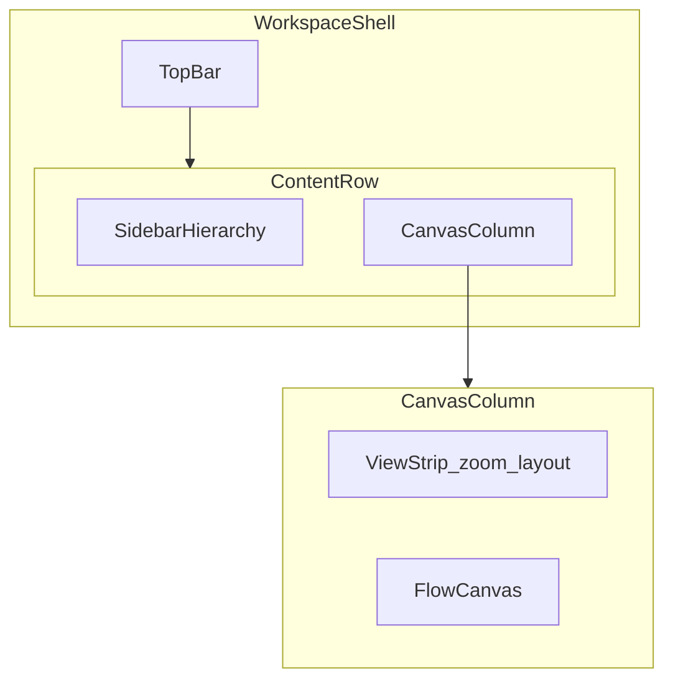

# サイトマップ「別タブで編集」ワークスペース — UI ワイヤー

実装参照: `RequirementsSitemapEditor` の `editorLayout="workspace"`。プラン全体は `.cursor/plans/sitemap_workspace_ui_1f1b31f8.plan.md`。

---

## 凡例

| 記号 | 意味 |
|------|------|
| `█` | UI クローム（バー・サイドバー） |
| `·` | キャンバス（図 / A4 プレビュー） |
| `[保存]` | プライマリ操作 |

---

## 1. 現状（概念ワイヤー）

キャンバス全面に対し、**階層**と**操作**が `fixed` の浮遊カードで重なる。ドラッグ可能なため「専用タブのアプリ骨格」と「一時パレット」の中間で迷いやすい。

```text
┌────────────────────────────────────────────────────────────┐
│ ····················· キャンバス（図） ···················· │
│ ┌──────────┐                                               │
│ │階層  ⋮ ‹ │                                               │
│ ├──────────┤                                               │
│ │ 一括操作 │                                               │
│ │ ┌──────┐ │                                               │
│ │ │TOP膨 │ │                                               │
│ │ │ 子… │ │                                               │
│ │ ├──────┤ │                                               │
│ │ │行…  │ │                                               │
│ │ └──────┘ │                                               │
│ └──────────┘                                               │
│              ┌─────────────────────────────────┐           │
│              │操作 ⋮                           │           │
│              ├─────────────────────────────────┤           │
│              │要件 Excel Gemini 印刷 PNG [保存]│           │
│              ├─────────────────────────────────┤           │
│              │100% − + 全体  レイアウト ▾       │           │
│              └─────────────────────────────────┘           │
└────────────────────────────────────────────────────────────┘
```

---

## 2. 提案フェーズ 1 — ドック型シェル

トップバーに **ナビ・作業・保存** を集約。左に固定幅ツリー。図エリアの**上端にビュー帯**（ズーム・レイアウトのみ）を分離。

追加要件:

- キャンバス図の領域は、`print-preview` の **A4 横プレビューに配置される描画範囲のみ**とする（矩形外は描画対象外）。
- A4 横の描画矩形は、`sitemap-workspace` 別タブ編集時に **モニタ中心中央（水平・垂直の中央）** に配置する。
- `print-preview`（`/project-list/11/requirements/print-preview?selected_page_id=default-page-0`）は **グリッドの点を廃止し、背景は真っ白**にする。

```text
┌────────────────────────────────────────────────────────────┐
│ ← 要件定義   サイトマップ    Excel │ Gemini │ 印刷 PNG │ [保存] │
├──────────┬─────────────────────────────────────────────────┤
│階層      │ 表示  100%  (−) (+) 全体  │  レイアウト  [水平 ▾]   │
│──────────┤─────────────────────────────────────────────────┤
│一括操作  │                                                 │
│          │ ············· キャンバス（図） ················ │
│┌────────┐│                                                 │
││ツリー  ││                                                 │
││行…     ││                                                 │
│└────────┘│                                                 │
│          │                                                 │
└──────────┴─────────────────────────────────────────────────┘
```

### 情報のグループ（トップバー左→右）

1. **ナビ**: 要件定義へ戻る、ページタイトル（サイトマップ）
2. **区切り**
3. **取込・AI**: Excel を取り込む、Gemini で編集
4. **区切り**
5. **書き出し**: 印刷、PNG（フェーズ 2 で「書き出し ▾」にまとめ可）
6. **区切り**
7. **保存**（右端、`accent`）

---

## 3. 提案フェーズ 2（任意）— インスペクター

選択行のラベル編集・子追加をツリー行から外し、**右ペインまたは Sheet** に寄せると一覧のスキャン性が上がる。

```text
┌────────────────────────────────────────────────────────────┐
│ （同上トップバー）                                          │
├──────────┬────────────────────────────┬───────────────────┤
│階層      │ 表示帯 + キャンバス         │ プロパティ         │
│（コンパクト│                          │ · 画面名           │
│ リスト） │                          │ · ラベル           │
│          │                          │ · 子を追加         │
└──────────┴────────────────────────────┴───────────────────┘
```

狭い幅では右ペインを `Sheet` に退避。

---

## 4. レイヤー構造（Mermaid）



---

## 5. HTML ビジュアル版（任意）

Plan モード外では、同内容のボックスレイアウトを `sitemap_workspace_wireframe.html` として `project-manager/docs/` に置ける（`estimate_preview_wireframe.html` と同様、ブラウザで直接開いて確認）。

## 6. 受け入れ基準（今回追加）

1. `print-preview` 画面でドットグリッドが表示されず、背景が白一色であること。
2. ワークスペース画面で図が描画されるのは A4 横の白キャンバス矩形内のみであること。
3. ワークスペース起動時、A4 横キャンバスが可視領域の中央（左右・上下の中心）に配置されること。
4. ワークスペースと `print-preview` でキャンバス基準（サイズ・余白感）が一致すること。
